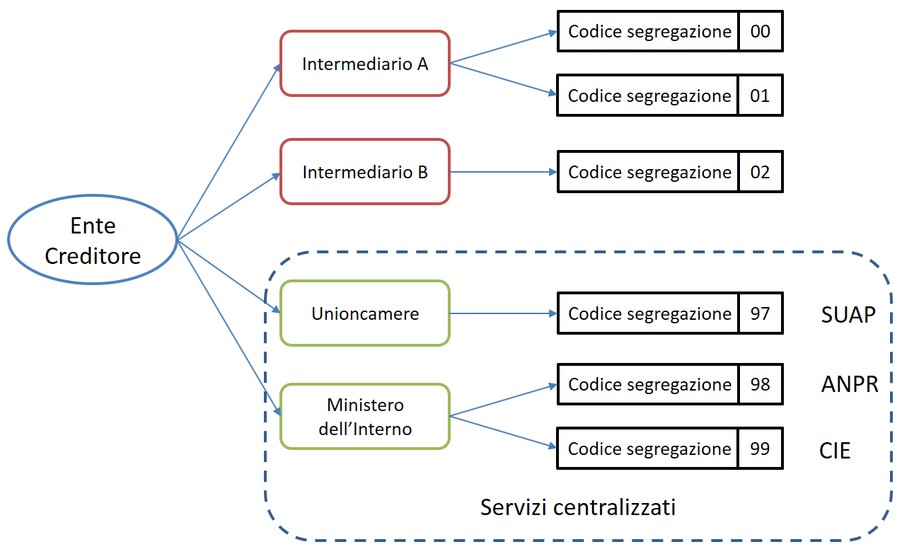

# Generazione dell’Identificativo Univoco di Versamento

Secondo quanto definito nel [paragrafo 7.1 delle Linee Guida](https://www.gazzettaufficiale.it/eli/id/2018/07/03/18A04494/sg) la generazione di un codice IUV che risulti **univoco** nel corso del tempo è una responsabilità in capo all'EC, che è libero di strutturarne la composizione secondo le proprie esigenze, facendo attenzione che tale codifica sia conforme agli standard internazionali esistenti e tenga conto in prima istanza della natura del pagamento (dovuto o spontaneo) ed in seconda istanza del numero dei “punti di generazione” del codice stesso ([Punti di generazione del codice IUV](./#punti-di-generazione-del-codice-iuv)).

## **Natura del pagamento**

Gli incassi che un EC deve gestire possono essere distinti secondo due diverse modalità:

1. su iniziativa dell’EC (o dovuti): è il caso in cui l’ente, attraverso un avviso (analogico o digitale), richiede un pagamento all’utilizzatore finale;
2. su iniziativa del debitore (o spontanei): nei quali l’utilizzatore finale, che deve effettuare a vario titolo un versamento a favore dell’ente, si attiva in via autonoma.

Nel primo caso, in cui il pagamento di un avviso precedentemente emesso da un EC venga eseguito attraverso i canali messi a disposizione dai PSP, si rinvia a [numero-avviso-e-codice-iuv-nel-caso-di-pagamenti-attivati-presso-i-psp.md](numero-avviso-e-codice-iuv-nel-caso-di-pagamenti-attivati-presso-i-psp.md "mention").

Nella seconda eventualità, associata ai pagamenti attivati presso l'EC, si rimanda a [codice-iuv-nel-caso-di-pagamenti-attivati-presso-lente-creditore.md](codice-iuv-nel-caso-di-pagamenti-attivati-presso-lente-creditore.md "mention"). Si tenga presente che se l’utilizzatore finale decide di effettuare il pagamento in un tempo successivo, e allo scopo richiede la stampa di un avviso analogico oppure l'invio di un avviso digitale, si ricade nel caso precedente.

## **Punti di generazione del codice IUV**

Il sistema pagoPA consente ad un EC di utilizzare uno più intermediari e/o partner tecnologici: tale circostanza fa sì che la generazione dello IUV possa avvenire in maniera indipendente presso più soggetti e possibilmente non sotto il controllo diretto dell’EC.

Tale situazione può essere presente anche presso EC dotati di un'organizzazione complessa e articolata in più unità organizzative autonome, che hanno la necessità di generare il codice IUV in maniera indipendente.

Si definisce quindi "punto di generazione del codice IUV" qualsiasi entità, facente parte o meno dell'organizzazione dell'EC, incaricata da questo di associare un codice IUV ad un unico pagamento presente nell'archivio dei pagamenti in attesa di cui al [capitolo 7 delle Linee Guida](https://www.gazzettaufficiale.it/eli/id/2018/07/03/18A04494/sg).

PagoPA S.p.A. attribuirà uno o più codici di segregazione (progressivamente a salire: da 00 a 49) ad ognuno degli intermediari/partner tecnologici, ovvero entità autonome dell'EC, secondo quanto da questi richiesto.

Se un EC genera in proprio attraverso entità autonome il codice IUV e si avvale contemporaneamente di un intermediario o di un partner tecnologico, le entità autonome dovranno essere censite alla stregua di intermediario/partner dello stesso ente.

## **Il codice di segregazione**

Tutto ciò premesso, è necessario definire delle regole affinché la codifica del pagamento risulti effettivamente univoca all'interno dell'Ente Creditore nel corso del tempo: questo risultato si ottiene associando ad ogni punto di generazione del codice IUV un particolare codice che serve a segregare i domini di gestione dei pagamenti dell'ente.

Tale codice viene denominato "codice di segregazione".

PagoPA S.p.A. attribuisce il codice di segregazione ad ogni punto di generazione del codice IUV in funzione del soggetto che svolge il ruolo di intermediario o partner tecnologico, secondo la seguente classificazione:

1. **Erogatori di servizi centralizzati**: intermediari tecnologici, che erogano servizi in modalità accentrata a livello nazionale;
2. **Punti di generazione del Codice IUV**: qualsiasi intermediario o partner tecnologico che non rientra nella classificazione precedente, nonché le unità autonome dell'ente.

Uno schema delle modalità di attribuzione del Codice Segregazione è riportata in Figura 1.

### **Erogatori di servizi centralizzati**

Sono quei soggetti, censiti a livello generale, che erogano servizi centralizzati per una comunità di EC con riferimento a procedure specifiche: quali, ad esempio, il SUAP, l'emissione on-line della Carta di Identità Elettronica, l'emissione dei certificati anagrafici tramite ANPR, ecc.

In alcuni casi, come ad esempio quello legato all’emissione on-line della CIE o dei certificati anagrafici, che consentono di effettuare contestualmente il pagamento del servizio, l’utilizzo della procedura centralizzata sarà obbligatorio per tutti i comuni italiani.

L'attribuzione della qualifica di erogatore di servizi centralizzati deve essere richiesta a PagoPA SpA che provvederà ad aggiornare l'elenco riportato nella Tabella 1.

#### Tabella 1 - Codici di segregazione dei servizi centralizzati

<table><thead><tr><th width="157.3560034943871">codice segregazione</th><th width="256.4239379394335">Soggetto che eroga il servizio</th><th>Servizio</th></tr></thead><tbody><tr><td>99</td><td>Ministero dell'Interno</td><td>Emissione on-line CIE</td></tr><tr><td>98</td><td>Ministero dell'Interno</td><td>Emissione certificati da ANPR</td></tr><tr><td>97</td><td>Unioncamere</td><td>SUAP</td></tr><tr><td>96</td><td>Automobile Club d’Italia</td><td>Pago bollo</td></tr><tr><td>85</td><td>PagoPA S.p.A.</td><td>Sussidiarietà TARI/TEFA</td></tr><tr><td>81</td><td>PagoPA S.p.A.</td><td>N/A</td></tr><tr><td>47</td><td>PagoPA S.p.A.</td><td>Canone Unico (2020)</td></tr></tbody></table>
