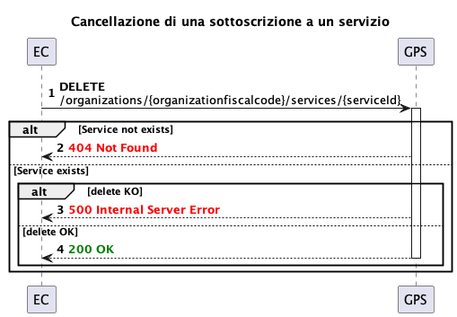
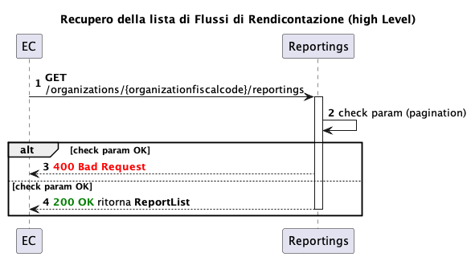

# Operazioni disponibili


Tutte le operazioni indicate sono segregate per codice fiscale dell'ente creditore (`organizationfiscalcode`). Il dato è recuperato in autonomia dal servizio partendo dalla subscription key utilizzata.

Per questo motivo, non sarà necessario definire `/organizations/{organizationfiscalcode}`nelle chiamate verso il servizio.

Le chiamate sono quindi da considerasi valide al netto di:

* base path (dipenderà dall'ambiente UAT/ PROD e maggiori dettagli si troveranno nel dev portal)
* identificazione dell'EC (eseguita in autonomia da parte del servizio tramite api key)


## Gestione posizioni debitorie

Nei seguenti sequence diagram si identifica con l'acronimo GPD il servizio di Gestione Posizioni Debitorie e con APD l'Archivio delle Posizioni Debitorie (base dati).

Per i dettagli [https://github.com/pagopa/pagopa-api/tree/SANP3.2.1/openapi](https://github.com/pagopa/pagopa-api/tree/SANP3.2.1/openapi).

### Creazione di una posizione debitoria


[gpd.yaml](../../.gitbook/assets/gpd.yaml)


.png>)

In fase di creazione della posizione debitoria il servizio effettuerà controlli sui dati in input e controlli di eventuali duplicati.

Tra i controlli dei dati in input si rilevano:

* obbligatorietà dei dati
* coerenza date (ad esempio `due_date` ≥ `validity_date)`
* coerenza importi (ad esempio la somma degli importi dei versamenti deve essere uguale all'importo totale)
* validità della tassonomia
* validità degli IBAN (devono essere censiti sulla piattaforma pagoPA)

Tra i controlli dei duplicati ci si basa sugli identificativi di pagamento (IUPD e IUV)

### Lettura di una lista di  posizioni debitorie e di una singola posizione debitoria


[gpd.yaml](../../.gitbook/assets/gpd.yaml)


.png>)

La lettura di una lista di posizioni debitorie prevede sempre una paginazione. E' inoltre possibile filtrare per `due_date` in modo da limitare i risultati.


[gpd.yaml](../../.gitbook/assets/gpd.yaml)


.png>)

La lettura di una posizione debitoria si basa sull'identificativo in input (IUPD). In caso lo IUPD non sia esistente verrà emesso un errore.

### Aggiornamento di una posizione debitoria


[gpd.yaml](../../.gitbook/assets/gpd.yaml)


.png>)

In fase di aggiornamento, oltre ai già citati controlli in fase di creazione , si verifica che la posizione sia esistente ed aggiornabile.

In particolare l'aggiornabilità della posizione debitoria dipende dallo stato della posizione stessa (ad esempio se una posizione è già stata pagata non sarà possibile aggiornarla)

### Cancellazione di una Posizione Debitoria


[gpd.yaml](../../.gitbook/assets/gpd.yaml)


.png>)

La cancellazione di una posizione debitoria prevede controlli sia sull'esistenza (IUPD) che sullo stato (ad esempio, una posizione debitoria non sarà cancellabile se è già stata pagata)

### Pubblicazione di una posizione debitoria


[gpd.yaml](../../.gitbook/assets/gpd.yaml)


.png>)

La pubblicazione della posizione debitoria permette il passaggio dallo stato `DRAFT` allo stato `PUBLISHED.`&#x20;

Una posizione in stato `DRAFT` (bozza) infatti non permette la normale operatività con la piattaforma pagoPA. Solo quando l'Ente Creditore pubblica la posizione, in coerenza con le date di validità e di scadenza, questa risulta pagabile sulla piattaforma.

### Invalidazione di una posizione debitoria


[gpd.yaml](../../.gitbook/assets/gpd.yaml)


L'invalidazione di una posizione debitore consiste di fatto in una cancellazione logica. E' possibile solo partendo dagli stati `PUBLISHED` e `VALID`.

La funzionalità è utile quando si vuole dare evidenza all'utente, in fase di pagamento, della invalidazione della posizione debitoria.

## Gestione  pagamenti spontanei

Nei seguenti sequence diagram si identifica con l'acronimo GPS il servizio di Gestione Pagamenti Spontanei.

Si identificano 2 entità:

* Ente Creditore (adesione al servizio di pagamenti spontanei)
* Servizio (sottoscrizione ad uno specifico servizio)

### Aggiunta di un ente creditore con eventuali sottoscrizioni a servizi


[gps.yaml](../../.gitbook/assets/gps.yaml)


.png>)

Con questa operazione è possibile aderire tecnicamente al servizio di gestione dei pagamenti spontanei. E' inoltre possibile, già in fase di adesione, definire l'iscrizione ai vari servizi.

Vengono effettuati controlli sintattici e semantici sui campi in input. In particolare, si segnalano controlli sulla bontà delle iscrizioni ai servizi (che devono essere presenti nell'elenco servizi)&#x20;

### Cancellazione di un ente creditore e relative sottoscrizioni


[gps.yaml](../../.gitbook/assets/gps.yaml)


.png>)

Questa funzionalità permette la cancellazione di un adesione di un Ente Creditore al servizio di  gestione dei pagamenti spontanei. Contestualmente vengono cancellate tutte le sottoscrizioni.

Questa operazione, per potere essere effettuata, deve essere preceduta da un adesione.

### Aggiornamento di un Ente Creditore&#x20;


[gps.yaml](../../.gitbook/assets/gps.yaml)


Con questa funzionalità è possibili aggiornare le proprietà dell'Ente Creditore in merito all'adesione al servizio.

Valgono gli stessi controlli definiti per la creazione dell' adesione, oltre ai controlli legati alla presenza di una precedente adesione.

### Lettura dei dati di un ente creditore e sottoscrizioni a servizi


[gps.yaml](../../.gitbook/assets/gps.yaml)


Questa funzionalità permette di recuperare, oltre alle proprietà dell'ente creditore, tutte le sottoscrizioni ai servizi.

### Sottoscrizione a un servizio


[gps.yaml](../../.gitbook/assets/gps.yaml)


.png>)

Con questa operazione è possibile aggiungere una sottoscrizione ad un servizio.

Vengono effettuati controlli in merito all'identificativo del servizio aggiunto (deve essere esistente e non deve essere già presente un sottoscrizione) oltre ai controlli sintattici e semantici sulle proprietà dell'adesione (IBAN, causale versamento, etc).

### Lettura di una sottoscrizione a un servizio


[gps.yaml](../../.gitbook/assets/gps.yaml)


.png>)

Con questa operazione è possibile recuperare le proprietà di una determinata sottoscrizione ad un servizio.

### Aggiornamento di una sottoscrizione a un servizio


[gps.yaml](../../.gitbook/assets/gps.yaml)


.png>)

Con questa operazione è possibile aggiornare le proprietà di una sottoscrizione precedentemente aggiunta.

Non è possibile cambiare il servizio con questa operazione.

### Cancellazione di una sottoscrizione a un servizio


[gps.yaml](../../.gitbook/assets/gps.yaml)


Con questa operazione è possibile cancellare la sottoscrizione ad un servizio precedentemente aggiunto.

## Flussi di rendicontazione

Sono messe a disposizione delle funzionalità di lettura dei flussi di rendicontazione:

* Lista di flussi di rendicontazione per un Ente Creditore
* Dettaglio del flusso di rendicontazione


[gpd_fdr.yaml](../../.gitbook/assets/gpd_fdr.yaml)



[gpd_fdr.yaml](../../.gitbook/assets/gpd_fdr.yaml)


