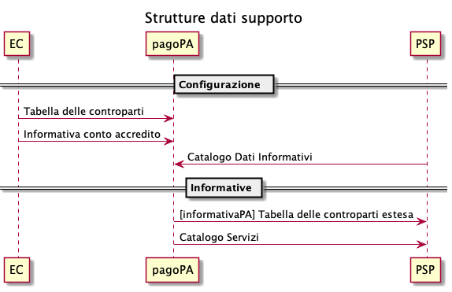

# Modello dati

Durante la descrizione delle interfacce si farà riferimento ad alcune entità le cui relazioni vengono mostrate dal seguente diagramma

* _Posizione Debitoria_: rappresenta l’entità (il servizio) per la quale l’EC vuole ricevere pagamenti tramite la piattaforma.
* _Avviso di Pagamento_: rappresenta la notifica (cartacea o digitale) della posizione debitoria verso il cittadino.
* _Pagamento_: descrive nel dettaglio l’operazione di pagamento correlata ad un avviso e contiene informazioni di incasso e di accredito.
* _Ricevuta_: descrive l’esito di un pagamento, contiene i dettagli dell’incasso e la previsione dell’accredito, contiene al suo interno anche il riferimento all’avviso di pagamento.
* _Flusso di Rendicontazione_: dettaglia il riversamento effettuato verso i conti correnti di un EC da parte di un PSP, contiene l’elenco di tutti i pagamenti.

## Strutture dati di business 

.png>)

Il _**payment**_ (pagamento) è un oggetto generato dall’EC, gestito dalla piattaforma pagoPA e inoltrato al PSP; l’EC fornisce questo oggetto alla piattaforma pagoPA con la response alla  [paGetPayment](../appendici/primitive.md#pagetpayment), la piattaforma pagoPA fornisce questo oggetto al PSP con la response alla [activatePaymentNotice](../appendici/primitive.md#activatepaymentnotice); l’oggetto _payment_ fornito al PSP contiene un subset di dati inviati dall'EC alla piattaforma pagoPA.

La _**receipt**_ (ricevuta) è un oggetto generato dalla piattaforma pagoPA sulla base dei dati ricevuti dalla response alla [paGetPayment](../appendici/primitive.md#pagetpayment) (da EC) e dalla [sendPaymentOutcome](../appendici/primitive.md#sendpaymentoutcome) (da PSP); viene inviato agli _n_ Enti Creditori interessati al pagamento per mezzo della primitiva [paSendRT](../appendici/primitive.md#pasendrt); l’oggetto _receipt_ viene inoltrato all’EC solo se il pagamento è stato effettuato.

Il _**flusso di rendicontazione**_ contiene le informazioni che devono essere messe a disposizione dell’EC per effettuare le operazioni di riconciliazione dei pagamenti, tale flusso deve essere reso disponibile ai soggetti interessati a cura del PSP che ha effettuato l’operazione di pagamento, entro e non oltre le ore 24 della seconda giornata lavorativa successiva alla ricezione dell’ordine di pagamento (D+2). I PSP inviano ogni singolo flusso di rendicontazione alla piattaforma pagoPA tramite la primitiva [nodoInviaFlussoRendicontazione](../appendici/primitive.md#nodoinviaflussorendicontazione); per la ricezione dei flussi di rendicontazione da parte degli EC le primitive da usare sono la [nodoChiediElencoFlussiRendicontazione](../appendici/primitive.md#nodochiediflussorendicontazione), per avere l'elenco dei flussi disponibili, e la [nodoChiediFlussoRendicontazione](../appendici/primitive.md#nodochiediflussorendicontazione) per scaricare uno specifico flusso.

.png>)

## Strutture dati di supporto 

La **Tabella delle controparti** contiene le informazioni relative alla erogazione dei servizi dell’EC, tra le informazioni rilevanti si identificano l'indicazione se l’EC consente i pagamenti presso i PSP (_pagamentiPressoPSP_) e l'aggregazione relativa alle fasce orarie di erogazione del servizio da parte dell’EC (_erogazioneServizio_), è generata tramite PdA.

L'**Informativa conto accredito** contiene le informazioni relative ai conti da accreditare, l'informazione più rilevante è l’International Bank Account Number, definito secondo lo standard ISO 13616, del conto da accreditare presso la banca di accredito indicata dall’EC, di norma la Banca Tesoriera (_ibanAccredito_), è generata tramite PdA.

Il **Catalogo Dati Informativi** è la struttura dati tramite il quale, ai fini della trasparenza delle operazioni, il Nodo dei Pagamenti-SPC censisce per i PSP i dati sulle condizioni di pagamento (costi massimi del servizio, pagine web con descrizione dei servizi, ecc.), tale catalogo è alimentato con cadenza giornaliera dai PSP stessi.

La **Tabella delle controparti estesa** è la struttura dati che il PSP può prelevare per avere informazioni in merito all'erogazione dei servizi (_Tabella delle controparti_) e ai conti da accreditare (_Informativa conto accredito_) per ogni EC, tale struttura può essere prelevata tramite la primitiva [nodoChiediInformativaPA](../appendici/primitive.md#nodochiediinformativapa).

.png>)

Il **Catalogo servizi** è utilizzato dai PSP per ottenere i dettagli di particolari servizi offerti da ogni EC, in modo da poter offrire il pagamento spontaneo ([pagamento-spontaneo-presso-psp](../casi-duso/pagamento-spontaneo-presso-psp/ "mention")), tale struttura può essere prelevata tramite la primitiva [nodoChiediCatalogoServizi](../appendici/primitive.md#nodochiedicatalogoservizi).

.png>)
