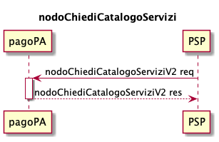

# Catalogo dei servizi

Il Catalogo dei Servizi è il repository che contiene l’elenco dei servizi generalizzati attivati dagli EC, relativi al processo di pagamento attivato presso i PSP in modalità spontanea.&#x20;

Il Catalogo dei Servizi viene aggiornato e pubblicato con cadenza giornaliera.

Le informazioni del Catalogo dei Servizi sono codificate in un file XML secondo il tracciato [https://github.com/pagopa/pagopa-api/blob/SANP3.3.0/xsd/CatalogoServizi\_2\_0\_0.xsd](https://github.com/pagopa/pagopa-api/blob/SANP3.3.0/xsd/CatalogoServizi\_2\_0\_0.xsd) e devono essere inviate da ogni EC a PagoPA S.p.A. attraverso le funzioni previste sul Portale dedicato all'Assistenza.



Le informazioni possono essere richieste dai singoli PSP alla piattaforma pagoPA utilizzando l'apposita primitiva [nodoChiediCatalogoServizi](../../appendici/primitive.md#nodochiedicatalogoservizi).&#x20;

Ad ogni servizio presente nel Catalogo dei Servizi è associato un insieme di dati specifici e necessari all'EC per fornire al PSP il _numero avviso_, tale insieme di dati è associato ad uno schema XSD che ne definisce il contenuto e permette il controllo delle informazioni, il nome di tale XSD è riportato nell'elemento _xsdRiferimento_ del Catalogo dei Servizi.

Di seguito un esempio di xml del Catalogo dei Servizi restituito nel tag _xmlCatalogoServizi_ in formato base64 tramite la primitiva [nodoChiediCatalogoServizi](../../appendici/primitive.md#nodochiedicatalogoservizi).&#x20;

```xml
<listaCatalogoServizi>
	<catalogoServizi>
		<idServizio>00009</idServizio>
		<descrizioneServizio>Pagamento mensa scolastica</descrizioneServizio>
		<elencoSoggettiEroganti>
			<soggettoErogante>
				<idSoggettoServizio>00035</idSoggettoServizio>
				<idDominio>77777777777</idDominio>
				<denominazioneEnteCreditore>Pagamento mensa scolastica asilo</denominazioneEnteCreditore>
				<dataInizioValidita>2022-04-30</dataInizioValidita>
				<dataFineValidita>2024-04-30</dataFineValidita>
				<commissione>N</commissione>
			</soggettoErogante>
			<soggettoErogante>
				<idSoggettoServizio>00036</idSoggettoServizio>
				<idDominio>77777777778</idDominio>
				<denominazioneEnteCreditore>Pagamento mensa scolastica materna</denominazioneEnteCreditore>
				<dataInizioValidita>2022-09-30</dataInizioValidita>
				<dataFineValidita>2024-09-30</dataFineValidita>
				<commissione>S</commissione>
			</soggettoErogante>
		</elencoSoggettiEroganti>
		<categoria>Mensa Scolastica</categoria>
		<xsdRiferimento>mensa_scolastica_1_1_0.xsd</xsdRiferimento>
	</catalogoServizi>
</listaCatalogoServizi>
```

* _idServizio_: identificativo del servizio;
* _descrizioneServizio_: descrizione globale del servizio;
* _elencoSoggettiEroganti_: elenco degli EC associati al servizio;
* _categoria_: categoria del servizio;
* _xsdRiferimento_: schema XSD che definisce il contenuto dei dati specifici del servizio e permette il controllo delle informazioni.

L'oggetto _soggettoErogante_ è così definito

* _idSoggettoServizio_: identificativo dell'associazione tra servizio e EC;
* _idDominio_: identificativo dell'EC;
* _denominazioneEnteCreditore_: descrizione attribuita dall'EC al servizio;
* _dataInizioValidita_: data di inizio validità del servizio per l'EC specifico;
* _dataFineValidita_: data di fine validità del servizio per l'EC specifico;
* _commissione_: flag che definisce la volontà o meno di associare una quota commissionale al servizio da parte dell'EC.
