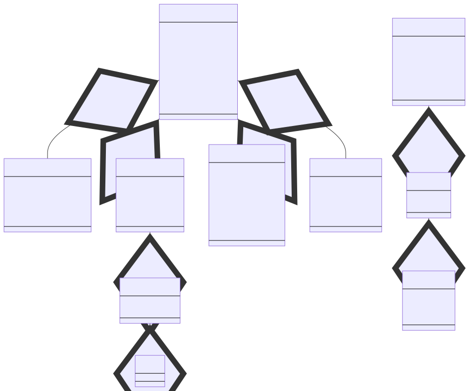

# API esposte da PDND Interoperabilità

## Obiettivi

* Dare la possibilità agli erogatori di portare a termine eventuali verifiche necessarie all'erogazione degli e-service ai fruitori;
* permettere agli aderenti di automatizzare parte del loro flusso sulla base delle informazioni reperibili.

## Dove si trovano?

L'URL del servizio e la specifica OpenAPI dell'interfaccia sono reperibili all'interno della sezione _Fruizione > I tuoi client api interop_, all'interno di qualsiasi client machine to machine venga creato. Non viene pubblicato qui perché l'URL varia in funzione dell'ambiente in cui ci si trova.

## Come si implementa un flusso?

Si prega di consultare la [sezione dedicata](utilizzare-i-voucher.md) all'ottenimento di un voucher da spendere sulle API di PDND Interoperabilità.

## Modello dati

Nell'API che PDND Interoperabilità espone il modello dati è come segue:

## Endpoint di notifica eventi

PDND Interoperabilità offre un canale in pull attraverso il quale l'aderente può ottenere una lista di eventi. Questi eventi rappresentano i cambiamenti di stato occorsi all'interno dell'infrastruttura. In pratica, l'aderente può avere una notifica per quando un e-service viene sospeso, una richiesta di fruizione riattivata, ecc.

Nonostante l'endpoint per ottenere gli eventi sia parte delle API esposte da PDND Interoperabilità, gli dedichiamo uno spazio apposito dato il rilievo della funzionalità. Il modello di canale pull prevede che l'erogatore si occupi di richiedere gli eventi di suo interesse in polling. I parametri specifici della chiamata sono parte della documentazione di interfaccia, qui ci limitiamo a specificare il meccanismo di funzionamento.

Ogni evento è identificato da un numero d’ordine crescente (id dell'evento). L'aderente può richiedere tutti gli eventi a partire da un determinato `eventId`, specificando la dimensione della paginazione, cioè il numero di eventi da restituire (`limit`) . L'aderente può fare caching dei risultati ottenuti, e scaricare ulteriori eventi a partire dall'ultimo `eventId` ottenuto.


L'obiettivo di questo strumento è di permettere agli erogatori di automatizzare parte del loro processo e ottenere aggiornamenti tempestivi sui cambi di stato legati ai fruitori dei servizi. È prevista una persistenza dell'informazione non superiore a due mesi.



Gli eventi coprono i cambi di stato sulle finalità (`purpose`), sulle richieste di fruizione (`agreement`) e sugli e-service (`eservices`).



All’erogatore è consentito di applicare una politica di polling a intervalli non inferiori a un minuto.

