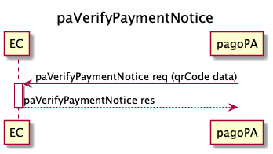
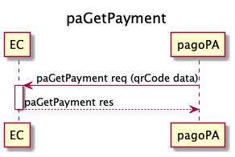

# Integrazione tramite API


Per la gestione degli errori fare riferimento a [Gestione degli errori](http://localhost:5000/o/KXYtsf32WSKm6ga638R3/s/mU2qgiLV1G3m9z1VjAOc/ "mention")


## Fase di richiesta di creazione della posizione debitoria

.png>)

La [paDemandPaymentNotice](../../appendici/primitive.md#pademandpaymentnotice) è utilizzata per richiedere all’EC la creazione della posizione debitoria in base ai dati dello specifico servizio inviati, l'EC invia in risposta le informazioni necessarie per avviare il processo di pagamento, in particolare:

* il numero avviso;
* il codice fiscale dell'EC da utilizzare nella fase di attivazione;
* l'importo parziale di ogni singolo versamento;
* il codice fiscale dell’EC beneficiario di ogni singolo versamento.

Durante questa fase la posizione debitoria deve rimanere nello stato _aperta._

Gli EC mettono a disposizione i dati dello specifico servizio tramite il [catalogo-dei-servizi.md](../../casi-duso/pagamento-spontaneo-presso-psp/catalogo-dei-servizi.md "mention").

## Fase di verifica

La [paVerifyPaymentNotice](../../appendici/primitive.md#paverifypaymentnotice) è utilizzata per richiedere all’EC la verifica dell’opzione di pagamento identificata dal numero avviso, che invia le informazioni di pagamento relative al numero avviso, in particolare:

* importo parziale;
* codice fiscale dell’EC beneficiario;
* il parametro _allCCP,_ che indica se l’opzione di pagamento è associabile a tutti conti correnti postali o meno
  * _allCCP = true_: l’opzione è associabile a tutti conti correnti postali;
  * _allCCP = false_: l’opzione non è associabile a tutti conti correnti postali.

Durante questa fase la posizione debitoria deve rimanere nello stato _aperta._

Il Nodo effettua una verifica semantica sulla response:

* deve essere presente la _paymentList_;
* il tag _officeName_ è opzionale, tutti i restanti tags sono obbligatori.

## Fase di attivazione

La richiesta di attivazione del pagamento giunge all’EC per mezzo della [paGetPayment](../../appendici/primitive.md#pagetpayment), l'EC invia l’importo del pagamento ed i dati necessari per il riversamento della somma, in particolare per ogni versamento:

* importo parziale;
* codice fiscale dell’EC beneficiario;
* IBAN da usare per il riversamento.

Durante questa fase la posizione debitoria deve rimanere nello stato _aperta_, sarà cura del Nodo inibire altri tentativi di pagamento per lo stesso numero avviso.

Il Nodo effettua una verifica semantica sulla response:

* verifica la corrispondenza tra il valore di _paymentAmount_ e la somma di tutti gli _amount_ presenti nei _transfer_;
* ci deve essere almeno un'occorrenza di _transfer_;
* controllo semantico degli IBAN in ogni _transfer_;
* viene verificata l'esistenza sul Nodo dell'associazione tra _fiscalCodePA_ e _IBAN_;
* nel caso di presenza di un'EC secondario viene verificato che sia abilitato sul Nodo.

## Fase di invio della ricevuta

Tramite la primitiva [paSendRT](../../appendici/primitive.md#pasendrt) viene inoltrata agli _n_ EC interessati al pagamento la _receipt_ (ricevuta) solo se il pagamento è stato effettuato, la _receipt_ è un oggetto generato dalla piattaforma pagoPA.

In questa fase, dopo la ricezione della _receipt_, la posizione debitoria deve essere posta nello stato _chiusa._
